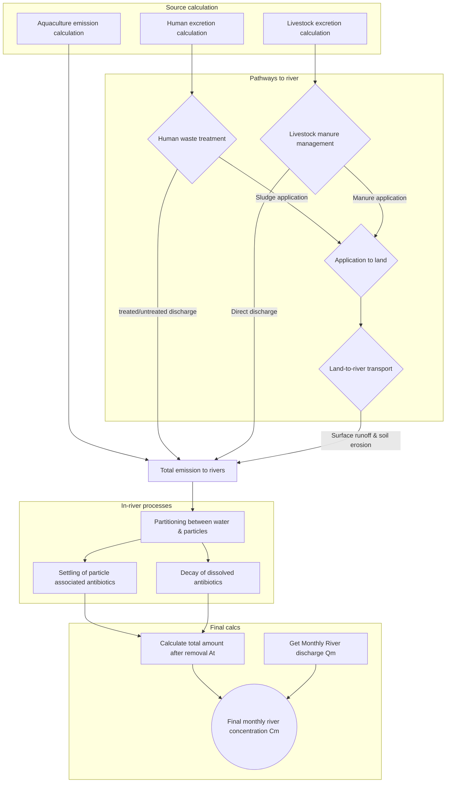
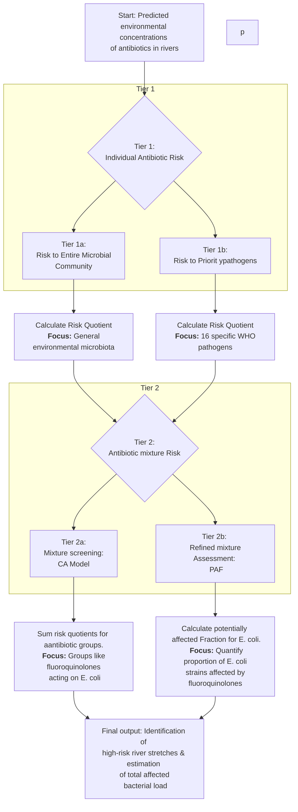

# Flowchart of SM ab paper

Still incomplete but a decent start. 

```mermaid
graph TD
    subgraph Source calculation
        A1[Human excretion calculation]
        A2[Livestock excretion calculation]
        A3[Aquaculture emission calculation]
    end

    subgraph Pathways to river
        B1{Human waste treatment}
        B2{Livestock manure management}
        B3{Application to land}
        B4{Land-to-river transport}
    end

    subgraph In-river processes
        C1[Partitioning between water & particles]
        C2[Settling of particle associated antibiotics]
        C3[Decay of dissolved antibiotics]
    end

    subgraph Final calcs
        D1[Calculate total amount after removal At]
        D2[Get Monthly River discharge Qm]
        D3((Final monthly river concentration Cm))
    end

    A1 --> B1
    A2 --> B2
    A3 --> E[Total emission to rivers]

    B1 -- treated/untreated discharge --> E
    B1 -- Sludge application --> B3

    B2 -- Direct discharge --> E
    B2 -- Manure application --> B3

    B3 --> B4
    B4 -- Surface runoff & soil erosion --> E

    E --> C1
    C1 --> C2
    C1 --> C3

    C2 & C3 --> D1
    D1 & D2 --> D3
```

# Flowchart of risk part

Also added this risk part. I found it difficult to make.

```mermaid
graph TD
    A[Start: Predicted environmental concentrations <br>of antibiotics in rivers] --> B{Tier 1:<br> Individual Antibiotic Risk};

    subgraph Tier 1
        B --> B1[Tier 1a: <br>Risk to Entire Microbial<br> Community];
        B --> B2[Tier 1b: <br>Risk to Priorit ypathogens];
    end
p
    B1 --> C1[Calculate Risk Quotient<br> <b>Focus:</b> General environmental microbiota];
    B2 --> C2[Calculate Risk Quotient<br> <b>Focus:</b> 16 specific WHO pathogens];

    C1 & C2 --> D{Tier 2: <br> Antibiotic mixture Risk};

    subgraph Tier 2
        D --> D1[Tier 2a: <br> Mixture screening: <br> CA Model];
        D --> D2[Tier 2b: <br> Refined mixture Assessment: <br> PAF];
    end

    D1 --> E1[Sum risk quotients for <br> aantibiotic groups. <br> <b>Focus:</b> Groups like fluoroquinolones<br> acting on E. coli];
    D2 --> E2[Calculate potentially <br> affected Fraction for E. coli.<br>  <b>Focus:</b> Quantify proportion of E. coli<br> strains affected by <br>fluoroquinolones];

    E1 & E2 --> F[Final output: Identification of <br>high-risk river stretches & estimation <br> of total affected <br> bacterial load];
```
