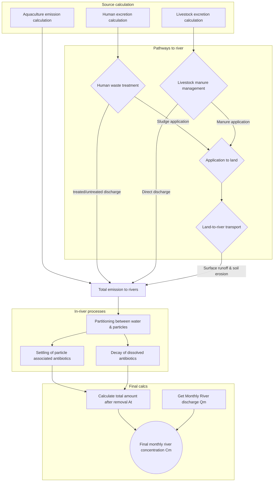

# Flowchart of SM ab paper

```mermaid
graph TD
    subgraph Source calculation
        A1[Human excretion calculation]
        A2[Livestock excretion calculation]
        A3[Aquaculture emission calculation]
    end

    subgraph Pathways to river
        B1{Human waste treatment}
        B2{Livestock manure management}
        B3{Application to land}
        B4{Land-to-river transport}
    end

    subgraph In-river processes
        C1[Partitioning between water & particles]
        C2[Settling of particle associated antibiotics]
        C3[Decay of dissolved antibiotics]
    end

    subgraph Final calcs
        D1[Calculate total amount after removal At]
        D2[Get Monthly River discharge Qm]
        D3((Final monthly river concentration Cm))
    end

    A1 --> B1
    A2 --> B2
    A3 --> E[Total emission to rivers]

    B1 -- treated/untreated discharge --> E
    B1 -- Sludge application --> B3

    B2 -- Direct discharge --> E
    B2 -- Manure application --> B3

    B3 --> B4
    B4 -- Surface runoff & soil erosion --> E

    E --> C1
    C1 --> C2
    C1 --> C3

    C2 & C3 --> D1
    D1 & D2 --> D3
```
